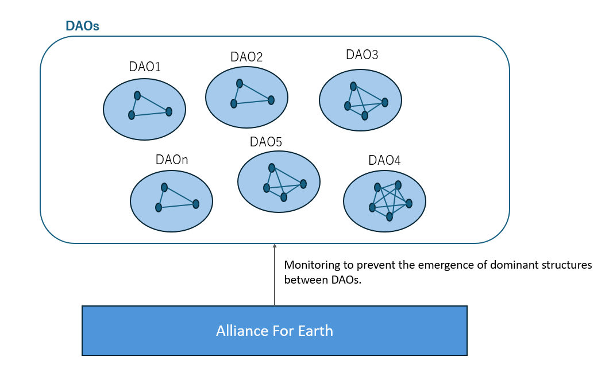

# 風の時代のコミュニティ
2026年までに、地球は5次元へ次元上昇するといわれています。 
その後の地球では無政府時代となり、DAOという小規模のブロックチェーン型の組織がたくさん形成されると予測されます。 
日本の縄文時代のように、考え方が一致する者同士でコミュニティを形成し、それぞれの個性が重んじられる本当の意味での多様性の時代がやって来ます。 
しかし、5次元へ次元上昇したとしても、DAO間で支配構造が生まれるリスクは存在します。
現在DSと戦っている地球アライアンスがその監視役となると考られます。※1 

※1 DAO内での支配構造も考えられるが、過干渉になってしまうのでコミュニティ内での解決を促すとします。

では、支配構造が生まれないようにどうすればいいのか。 
それは、スターウォーズエピソード1~3のアナキンがダースベイダーになるまでの過程にヒントがあります。 
アナキンは、彼の母やパドメなど大切な人を守るのが彼のアイデンティティでした。しかし、ジェダイの掟が真っ向からそれを否定し、情を捨て、命令にしたがうことを強制しました。それによりアナキンは正義のはずのジェダイに疑問を抱き、ダークサイドへと落ちました。

このことから、大事なことは、すごくシンプルです。 
・自分と自分以外を区別する。(DAO内でも同様) 
・価値観を限定するルールを作らないこと。(DAO内でも同様) 
これらを実現するには、まず一人一人(5次元へ行きたい人のみ)が内観し、自分の魂の声を聴き、アイデンティティを発掘することです。 
技術的手段として、DAO間の権限分離や量子コンピュータ×AIによる不正監視、ブロックチェーンによるデータ改ざん防止が挙げられます。
