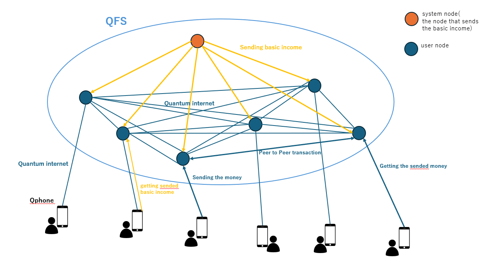

 # 風の時代のテクノロジー
これからの風の時代では、様々な宇宙技術が花開くといわれています。 
宇宙技術の基本は、量子技術であり、今水面下では開発が進められている(実は、完成しているかも？)そうです。 
それらの技術には以下のようなものがあります。 
- メドベッド
- レプリケータ
- ユーティライザー
- 量子コンピュータ
- 量子インターネット
- QFS(量子金融システム)
- Qphone

メドベッドは、プラズマエネルギーによりDNA自体を修復/向上させ、病気の治療や免疫力の向上に使われます。
個人的には、患部にパッチを貼り放置しておくと、自然に治癒するものが登場すると思っています。 
レプリケータは、量子レベルで物質をレプリケートし、ユーティライザーはその逆で物質を量子レベルで分解します。
これらにより、食料や物不足の解消やゴミの発生防止につながるといわれています。

しかし、最も興味深いのは量子コンピュータや量子インターネット、QFS、Qphoneなどの量子IT技術です。 
これらの関係性を下図に示してみました。(あくまで、調べた中で自分なりの見解です)

QFSは量子コンピュータとブロックチェーンで構成されており、各ユーザーはQphoneから量子インターネットを介して自分のノードに接続します。 
これにより、個人間の金銭取引が可能になります。（実際、送金処理などはAIが行っていると思います） 
また、ベーシックインカムはQFSを通じて個人に送られるといわれています。上の図に示されているように、ベーシックインカムを送るノード（システムノード）があり、そこから各個人のユーザーノードに送られると考えています。

様々な量子技術により人々の生活が安定し、各個人がそれぞれの御魂に沿った生き方ができることを心から願っています。